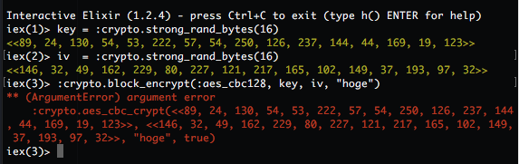

# Encryption with Erlang/Elixir
## Ryo Kajiwara
## tokyo.ex #1 Lightning Talks

---


## About me

- 梶原 龍 (sylph01)
  - Github: @sylph01
	- Twitter: @s01
- **ID + IoT = IDIOT** なエンジニアをしています
- Elixirは1.0から

---

---

#[fit] Erlang/Elixirで
#[fit] 暗号化しよう！

---

# 忙しい人のための暗号化戦略

最重要: **暗号アルゴリズムを自前実装するな。ライブラリ使え。**

いくら論文通りに実装したつもりでもそのコンパイルされたコードは途中のメモリの状態まで含めて安全ですか？

ちゃんとコードレビューされててbattle-provenな既存ライブラリ使いましょう。

---

#[fit] 【朗報】
#[fit] 自前実装
#[fit] いらない

---

# Elixir/Erlangでの暗号化

- (基本的には)Erlangのcryptoモジュールを使います
- 実体はErlangのNative Implemented Function(NIF)でOpenSSLなどを呼んでいる
    - https://github.com/erlang/otp/blob/maint/lib/crypto/c_src/crypto.c
- Erlang/Elixirで暗号化アルゴリズム実装したくない
    - サイクル途中のメモリ状態まで(コピーの多発する)Erlangで制御しきれるか？

---

# ハッシュ、HMAC

厳密には暗号化ではないが…

```elixir
:crypto.hash(:sha256, "hogehoge")
:crypto.hmac(:sha256, "keykey", "hogehoge")
```

`:md5`, `:ripemd160`, `:sha`, `:sha224`, `:sha256`, `:sha512` が使えます

HMACでは `:ripemd160` は使用不可

---

# 忙しい人のための対称鍵暗号

- AESを使いましょう
    - CBCモードがよく使われていたけど
    - 秘密性だけが問題ならCTRモード
    - 改竄耐性も欲しければGCMモード
		- 初期化ベクタの使い回しはNO
- 公開鍵暗号は確かに強いけど遅いので対称鍵暗号とセットで

^ https://www.w3.org/2012/webcrypto/draft-irtf-cfrg-webcrypto-algorithms-00

---

# AES-CBCモード

```elixir
key = :crypto.strong_rand_bytes(16)
iv  = :crypto.strong_rand_bytes(16)
:crypto.block_encrypt(:aes_cbc128, key, iv, plaintext)
```

ブロック長128bits = 16bytes、鍵長は128/192/256bits。

ブロック長が16bytesの倍数でないとArgumentError

---



---

# ブロック長のpadding(1)

`plaintext`の長さは16bytesの倍数である必要があるのでpaddingする。以下例

```elixir
pad = fn w, b ->
  case (rem (w - :erlang.size(b)), w) do
    0            -> b
    n when n < 0 -> b <> :binary.copy(<<0>>, w + n)
    n when n > 0 -> b <> :binary.copy(<<0>>, n)
  end
end
```

---

# ブロック長のpadding(1)

```elixir
unpad_stub = fn b, f ->
  last = :binary.last(b)
  case last do
    0 -> l = :erlang.size(b); f.(:binary.part(b, {0, l - 1}), f)
    _ -> b
  end
end

unpad = fn b -> unpad_stub.(b, unpad_stub) end
```

---

# 閑話休題: 無名関数の再帰

言語上では無名関数の再帰はサポートされていないので、Zコンビネータ $$\lambda f. (\lambda x. f(\lambda y. x x y)) (\lambda x. f(\lambda y. x x y))$$ を導入する:

```elixir
z = fn f ->
  (fn x ->
    f.(fn y -> x.(x).(y) end)
  end).(fn x ->
    f.(fn y -> x.(x).(y) end)
  end)
end
```

---

# 閑話休題: 無名関数の再帰

そうすると以下のようにunpadを書き直せる:

```elixir
unpad = fn f ->
  fn b ->
    last = :binary.last(b)
    case last do
      0 -> l = :erlang.size(b); f.(:binary.part(b, {0, l - 1}))
      _ -> b
    end
  end
end

b = <<"asdfasdf">> <> :binary.copy(<<0>>, 8)
z.(unpad).(b) # => "asdfasdf"
```

---

# 閑話休題: 無名関数の再帰

https://github.com/Dkendal/exyz を使うともっと簡潔に書き下せる:

```elixir
unpad = Exyz.z fn b ->
	last = :binary.last(b)
	case last do
		0 -> l = :erlang.size(b); f.(:binary.part(b, {0, l - 1}))
		_ -> b
	end
end

unpad.(b)
```

わざわざ外側の関数書かなくてよいので楽！

---

# ブロック長のpadding(2)

0埋めすると末尾が0で終わっているようなファイルは元の形式を取り戻せなくなる。

ブロックの最終バイトの値がpaddingの文字数を示すようなpadding(PKCS #7)を使うと元の形式を維持できる。

例： ``"abcdefgh"`` -> ``"abcdefgh\b\b\b\b\b\b\b\b"`` (`\b` = 0x08)

---

# ブロック長のpadding(2)

よって以下のようにpaddingを付加し:

```elixir
pkcs_pad = fn w, b ->
  case (rem (w - :erlang.size(b)), w) do
    0            -> b <> :binary.copy(<<16>>, 16)
    n when n < 0 -> l = w + n; b <> :binary.copy(<<l>>, l)
    n when n > 0 -> b <> :binary.copy(<<n>>, n)
  end
end
```

---

# ブロック長のpadding(2)

以下のようにpaddingを外す:

```elixir
pkcs_unpad = fn b ->
  len  = :erlang.size(b)
  last = :binary.last(b)
  :binary.part(b, {0, len - last})
end
```

---

# AES-CTRモード

CTRモードはストリーム暗号としての性質を持つのでpaddingを気にする必要がない。

```elixir
# omit creation of key/iv
# encryption
state = :crypto.stream_init(:aes_ctr, key, iv)
{new_state, cipher} = :crypto.stream_encrypt(state, plaintext)
# decryption
state = :crypto.stream_init(:aes_ctr, key, iv)
{new_state, plaintext} = :crypto.stream_decrypt(state, cipher)
```

---

# AES-GCMモード

認証付き暗号。AAD(Associated Authentication Data)を使ってメッセージが改竄されていないかを検証する。CTRモードを暗号化に使い、$$GF(2^{128})$$における乗法を使ったハッシュ計算を行う。

---

# AES-GCMモード

block_encrypt/4 を呼んでいるが、暗号化に使われるのはCTRモードなのでaadもplaintextもブロック長にpaddingしなくてよい。

```elixir
# omit creation of key/iv
{ciphertext, ciphertag} =
  :crypto.block_encrypt(:aes_gcm, key, iv, {aad, plaintext})

plaintext =
  :crypto.block_encrypt(:aes_gcm, key, iv, {aad, ciphertext, ciphertag})
# may return :error when decryption/validation fails
```

---

# AES-GCMモード

認証の例

```elixir
{cipher, ctag} = :crypto.block_encrypt(:aes_gcm, key, iv, {"aad", "plaintext"})

# this returns :error because AAD is wrong
:crypto.block_decrypt(:aes_gcm, key, iv, {"wrong_aad", cipher, ctag})

# this successfully decrypts and returns plaintext
:crypto.block_decrypt(:aes_gcm, key, iv, {"aad", cipher, ctag})
```

---

#[fit] 時間なさそうなので
#[fit] ここまで

---

# まとめ

- Erlang/OTPのcryptoモジュールすごい
    - http://erlang.org/doc/man/crypto.html
		- 公開鍵暗号もあるがAPIがすごく使いにくい
- モードによってpaddingだけどうにかしないといけない
- 鍵の管理とかは別の問題なのでそこはがんばりましょう
